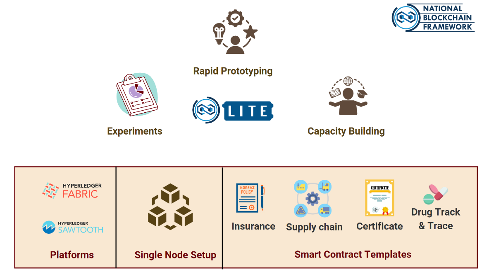

# Vishvasya: National Blockchain Technology Stack

This repository tracks the evolution of National Blockchain Framework (NBF) and the National Blockchain Technology Stack an initiative of MeitY.

## National Blockchain Framework

## National Blockchain Technology Stack

  

Vishvasya: National Blockchain Technology Stack launched on 4th Sept 2024 is security audited platform **to aid large scale adoption of Blockchain technology** and **enable trust for applications in the domain of e-Governance.** 

#### Focus on 
- Enabling Blockchain-as-a-Service (BaaS)
- Addresses the research challenges across various layers of the Blockchain stack.
- Design and development for deployment of blockchain based applications with several components
  - Dashboard for automated network setup
  - Generic Smart Contract layer
  - Authentication and Authorization functions
  - Enabling the same through Open APIs.  . 

### References
- [CDACChain - NBF Lite](https://cdacchain.in/nbflite/)
